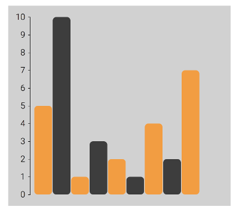

# Oppgave 2 - Bar chart i SVG

Denne oppgaven går ut på å ta disse enkle dataene:

~~~javascript
const data = [5, 10, 1, 3, 2, 1, 4, 2, 7];
~~~

og få dette resultatet:



Legg merke til y-aksen og fargene. Oppgaven er ferdig når du synes at ditt resultat er likt nok.

## Utdelt oppsett, bygging, kjøring og fasit

Oppsettet er stort sett slik som forrige oppgave `1-table`. Er ikke det praktisk?

## Tips

* Denne gangen skal vi lage en SVG. For å slå opp hvordan man lager ulike elementer anbefales Mozilla Developer Network: https://developer.mozilla.org/en-US/docs/Web/SVG/Element/rect

* For å gruppere svg-elementer slik at man kan gi dem felles attributter og flytte de rundt som en samling kan det være greit å bruke en `<g>`: https://developer.mozilla.org/en-US/docs/Web/SVG/Element/g

* SVG-elementer kan styles med CSS. Det kan iblant være mye mer praktisk enn å gjøre ting i ren SVG. Slik kan kan f.eks. style `text`-elementer som har klassen `.tick`:

```css
.tick text { 
  font-size: 1.5rem; 
  transform: translate(-5px, 0);
}
```

* I stedet for å regne ut posisjonen til alle stolpene for hånd kan man bruke `scaleLinear()` fra modulen `d3-scale`. Alle modulene er godt forklart i sin dokumentasjon: https://github.com/d3/d3-scale#continuous-scales

* Alle kode-eksempler for D3 på nettet er på formen `d3.scaleLinear()`, men med måten vi importerer moduler i bygget vårt blir det bare `scaleLinear()` uten `d3.`. Se øverst i `BarChart.js` hvordan modulene blir importert:

```javascript
import { scaleLinear } from "d3-scale";
import { max } from "d3-array";
import { select } from "d3-selection";
import { axisLeft } from "d3-axis";
```

* For å lage en akse med etiketter bør man bruke `d3-axis`. For eksempel `axisLeft(scale)` som tar en skala fra `d3-scale` som argument, og returnerer en generator-funksjon som bygger en ferdig akse. Se dokumentasjonen på https://github.com/d3/d3-axis

* For å bruke en generator-funksjon på en SVG kan man legge til en gruppe `<g>` og kalle generatoren for å fylle den gruppa med elementer:

```javascript
const yAxis = axisLeft(myScale);

select(svg)
    .append("g")
    .call(yAxis);
```